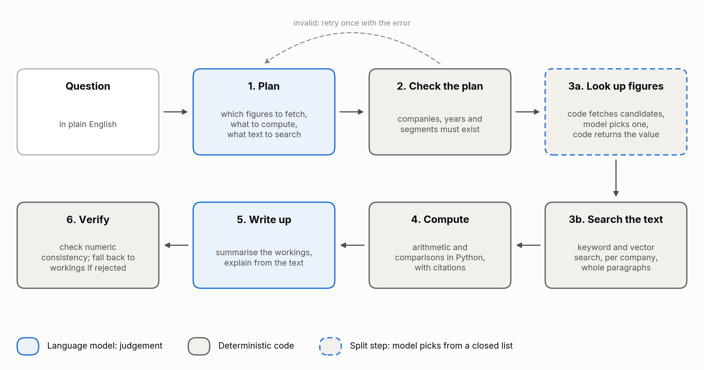
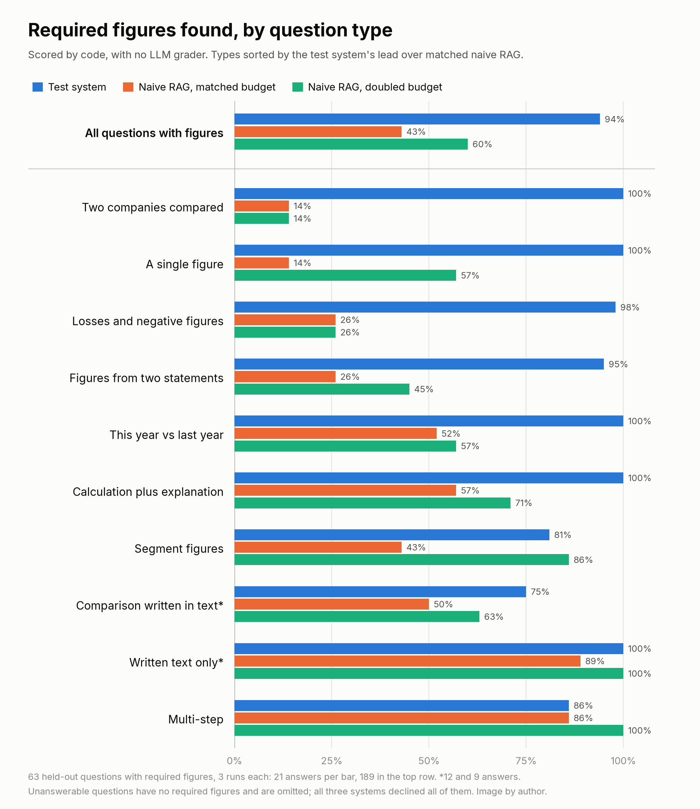

# Keep the LLM Out of the Deterministic Steps

*Six guidelines for splitting LLM question-answering systems into probabilistic and deterministic steps, tested against naive RAG on 77 held-out questions about SEC filings.*

---

Many questions sent to large language models (LLMs) have one correct answer. What was Intel's free cash flow in fiscal 2023? How many P0 incidents did we log in March? The answer is a value in a structured record. A fluent answer that differs from it is wrong.

Naive retrieval-augmented generation (RAG) retrieves the text chunks closest in meaning to the question and lets the LLM write the answer. Similarity decides which figure the LLM sees. On FinanceBench, GPT-4-Turbo with retrieval answered 81% of questions about company filings incorrectly or refused [1]. This article gives six guidelines for moving exact work out of the LLM. The techniques are established: tool calling, program-aided reasoning and text-to-SQL all do this. The contribution here is a controlled comparison and an analysis of where the design still failed. A deterministic step produces the same output from the same inputs. That does not make it correct: vector search can deterministically retrieve the wrong passage. The guidelines concern lookups and calculations whose inputs and rules can be stated and whose results can be checked.

## The test

I built a system that follows the guidelines (Figure 1). An LLM writes a plan. Code looks up tagged figures, does the arithmetic and searches the text. The LLM writes the answer from the results. The baseline is naive RAG with the same LLM and embeddings, at a matched text budget of about 9,500 characters and at double that. Each system answered 77 held-out questions about 33 annual reports (10-Ks) from 11 semiconductor companies, three times. 44 questions concern four companies the system never saw during development. Details are in the appendix.

*Figure 1. Blue steps use the LLM. Grey steps are code. In the dashed step, code fetches candidate rows, the LLM picks one and code returns its value. Image by author.*

## Two failures of naive RAG

Asked for Analog Devices' and Microchip's fiscal 2024 operating margins, naive RAG retrieved the wrong year and tables without company totals. It never answered. Asked for Intel's fiscal 2023 free cash flow, defined in the question as operating cash flow minus additions to property, plant and equipment, it answered −$11,757 million in all six runs. The correct figure is −$14,279 million [2]. It had taken capital spending from an adjusted table with a nearly identical label.

Both failures have one cause. A named figure for a named company and year is fixed by explicit fields: line item, company and period. Naive RAG chose it by closeness in meaning. The search was repeatable. Its criterion was wrong.

## Guideline 1: Split the task into deterministic and probabilistic steps

Ask two questions of each step. Could two careful people with the same inputs give different acceptable outputs? Then the step needs judgement, and it goes to the LLM. If not, can it be implemented and checked directly? Then write it as code.

Finding a company's operating income mixes both. Deciding which row the question means needs judgement, because filings label it "Operating income", "Income from operations" or something longer. Returning that row's value is exact. In the test system, code fetches candidate rows, the LLM picks one from a numbered list and code returns the stored value.

**Limit.** Exact lookup needs a structured record. A value that appears only in prose falls back to retrieval.

## Guideline 2: Keep structured data structured

Flattening a table into text keeps its labels. It breaks the link between each value and its row, column, period and unit. If users will filter, count or calculate with a field, keep it in a table.

Under the SEC's Inline XBRL rule, each figure in a filing's financial statements carries a tag for its concept, period and segment [3]. The test system loads the tags into a table and embeds only the prose. On single-figure questions it found the required figure in 100% of answers. Naive RAG found it in 14%. It reported Microchip's research and development expense as $1,100 million, from a chunk that said "$1.10 billion". The table says $1,097.4 million.

**Limit.** Someone must write the loader. That is cheap for tagged filings and expensive for PDFs.

## Guideline 3: Give the LLM a closed list when the answer is in a known set

When the valid outputs form a known set, show the LLM the set and accept only its members.

Asked which of AMD's segments earned the most, the planning step invented "Client and Gaming" by merging two real segment names. It now plans only with the segments AMD reports.

**Limit.** Search queries are free text. No list covers them.

## Guideline 4: Validate LLM output with code

Put a code check between the LLM and every step that depends on exact values.

The test system rejects a plan that names a company, year or segment absent from the database, and returns it to the LLM with the error. It also discards a final answer that states a number absent from the workings and the question.

**Limit.** The number check is crude. It ignores sign and units, skips anything that looks like a year and cannot tell which label a number belongs to. It catches a number with no source. A real number under the wrong label passes. The code and a full list of its gaps are in the repository.

## Guideline 5: Measure and tune retrieval as rigorously as lookup

Prose questions need search, and search needs its own measurement.

In development, the test system trailed naive RAG on prose-only questions, 72% to 83%. Most of its passages started mid-sentence. Cutting at paragraph breaks, adding keyword search beside embedding search and searching each company separately closed the gap. On held-out prose questions it passed 100% of answers against 95%. Both comparisons are LLM-graded.

**Limit.** These fixes were tuned on this corpus. Another corpus needs its own measurement.

## Guideline 6: Test the grader before trusting its scores

An LLM grader is itself probabilistic. Test it on answers with known errors before trusting its scores.

My first LLM grader passed an answer with planted wrong dates in five of five trials. It checked claims against the filings and ignored the answer. Making it quote the answer before its verdict fixed this.

**Limit.** A planted-error test covers only the errors you think to plant.

## Results

The protocol's primary measure was the pass rate below, which an LLM partly grades. Its fallback, if the grader proved unreliable, was a measure computed by code. The grader was never validated, so I lead with the fallback: required-figure coverage, the share of an answer's required figures that appear anywhere in it, within tolerance. Averaged over three runs per question and then over the 63 held-out questions with required figures, coverage was 94% for the test system, 43% for naive RAG at the matched budget and 60% at the doubled budget. The gap over the matched baseline was 51 points (95% confidence interval: 39 to 63). On the four unseen companies, it was 92% against 49%. Code makes the measure reproducible. It does not make an answer correct.

Code matching ignores which label a figure is attached to. As a check added after the run, I also required the LLM grader to confirm each matched figure under its metric, company and period. Coverage became 92%, 40% and 57%, and the gap over the matched baseline widened slightly, from 51 to 52 points (95% confidence interval: 40 to 64).

The pass rate adds the claims, which an LLM grades. An answer passes when it contains every required figure and every required claim. Extra errors fail an answer only when they contradict a required claim, so a pass measures completeness. The test system passed 93% of answers, against 41% for naive RAG at the matched budget and 55% at the doubled budget.

*Figure 2. Required figures found, by question type, scored by code. Most types have 7 questions, so differences between types are indicative. Image by author.*

The main limits:

- **No ablation.** The gain cannot be attributed to any single guideline.
- **Narrow scope.** One domain, one answer LLM, 7 questions per type.
- **LLM-written answer key.** No domain expert reviewed it.
- **Coverage is not correctness.** The test system's answers state a median of 8 numbers against 4 for naive RAG, because they show their workings. More numbers give a stray match more chances. The label check above moved every system by 1 to 3 points. The grader rejected 17 matched figures: 3 from the test system and 14 from naive RAG. All 17 were rounding disputes within tolerance, not figures under the wrong label. That check relies on the unvalidated grader. On the Intel segment question below, the test system named the wrong segment in all three runs yet scored full coverage. Its workings gave the right segment's figures under the right labels. Only the pass rate caught the wrong conclusion.
- **Unvalidated grader.** The pre-registered human check of the LLM grader was not done. Pass rates and prose results depend on that grader. Required-figure coverage does not.

## Where the guidelines ran out

The test system failed the pass rule on 17 of 231 answers. Six were confident wrong answers from one gap.

Asked which Intel segment had the highest 2023 operating margin, it named Client Computing Group at 32.51%. The answer, from the fiscal 2023 report, is Mobileye at 31.94%. Intel's fiscal 2024 report restates 2023 segment results and gives Client Computing $9,513 million of operating income. The fiscal 2023 report gives $6,520 million, a 22.28% margin. The system mixed the two reports. An Analog Devices question failed the same way, on reclassified revenue.

The lookup was exact and repeatable. Its key, company and fiscal year, was incomplete: one year's figure can appear in three reports. A fix is to store each figure's source report and prefer the one the question names. The latest report is a reasonable default for questions about the current picture. Questions about what was reported at the time need an explicit source-date policy. I have not tested either rule.

In the other 11 failures, a lookup or search found no matching row or passage, such as a segment's revenue. The system reported what it had and declined the rest.

Structured lookup stops relying on passage similarity for the final value. It brings two failure modes of its own. A key that misses a distinction in the data gives a confident wrong answer. A row the lookup cannot find gives an honest refusal.

## When to skip this

The advantage was small or absent for prose-only, unanswerable and multi-step questions. On segment questions the test system found 81% of required figures against 43% for naive RAG at the matched budget, but naive RAG found 86% at the doubled budget. At that budget it also matched or beat the test system on prose and multi-step questions. The test system was also slower: 9.3 seconds per answer against 5.1. If one prose passage answers most of your questions, naive RAG is simpler and did about as well here.

## Conclusion

Give the LLM the steps that need judgement, and give code the lookups and calculations that can be specified and checked. On the 63 held-out questions with required figures, the system's required-figure coverage was 94%, against 43% for naive RAG at the matched text budget and 60% at double that budget. The six confidently wrong answers identified in the failure analysis came from a missing source-selection rule, so the rules code runs on need the same scrutiny as the LLM.

The code, questions, answer key and every system output are at https://github.com/vinyasv/financeragv2.

## Appendix: Method

- **Questions.** 77 held-out questions, 7 in each of 11 types. 44 concern Analog Devices, Marvell, ON Semiconductor and Microchip, which played no part in development. 33 are new questions about the seven development companies. The system was built on 54 separate development questions. Both systems searched all 33 reports.
- **Answer key.** LLM agents with no access to either system wrote the questions and answers. Two more agents answered each question independently. An adjudicator resolved and logged every disagreement.
- **Freeze.** Questions, answer key, code, grading rules and analysis script were hashed (SHA-256) before any system ran. The freeze was not signed off in writing or published in advance. The hashes and file timestamps are in the repository. One pre-registered step, a human check of the LLM grader on 99 claims, was not done.
- **Models.** Answer LLM `openai/gpt-6-luna` at temperature 0. Embeddings `openai/text-embedding-3-small`. Postgres with exact (unindexed) vector search. Naive RAG retrieved 6 chunks at the matched budget and 12 at the doubled budget. The test system retrieved about 10,500 characters.
- **Figure matching.** Code parses each number in an answer, with its sign and any "billion" or "thousand". A required figure is matched if any number falls within tolerance: 0.5 for USD millions, 0.05 points for percentages, 0.005 for ratios. Code does not check which metric a number is attached to. The test system's answers state a median of 8 numbers against 4 for naive RAG. The label check, added after the run and not pre-registered, also requires the grader's verdict on that figure's claim to be "stated". It reuses verdicts from the original grading run and makes no new model calls. Script and output: `eval/sensitivity.py` and `eval/heldout/results/sensitivity.md`.
- **Claim grading.** `google/gemini-3.8-flash` at temperature 0 grades each required claim as stated, contradicted or missing, from the answer alone. It passed a planted-error test before the run.
- **Pass.** The protocol calls this metric "correct". It is renamed here because it measures completeness. Scores are unchanged.
- **Statistics.** A question's score is its mean over three runs. Required-figure coverage is each question's share of required figures found, averaged over its three runs and then over the 63 questions with required figures (189 answers per system). Unanswerable and some prose questions have none. Pooling all 101 required figures instead gives 94%, 40% and 54%, because questions with more figures then weigh more. The confidence interval is a paired bootstrap over questions (10,000 resamples). Per question, the test system scored higher on 40 and lower on 2 (exact sign test, Holm-adjusted p < 0.001). Pass rates cover all 231 answers per system. The pass-rate gap over the matched baseline was 52 points (95% confidence interval: 39 to 63), higher on 45 questions and lower on 2.
- **Cost.** Median latency 9.3 seconds and 2.8 model calls per answer for the test system, against 5.1 seconds and 2.0 calls for naive RAG. Cost in money was not measured.
- **Disclosure.** I built the test system and the question pipeline with help from an AI coding assistant.

## References

[1] P. Islam et al., FinanceBench: A New Benchmark for Financial Question Answering (2023), arXiv:2311.11944

[2] Intel Corporation, Annual Report on Form 10-K for fiscal year 2023 (2024), SEC EDGAR. Net cash provided by operating activities: $11,471 million. Additions to property, plant and equipment: $25,750 million.

[3] U.S. Securities and Exchange Commission, Inline XBRL Filing of Tagged Data, Release No. 33-10514 (2018), sec.gov

All figures are by the author. Source data: 10-K filings from SEC EDGAR, public domain.
